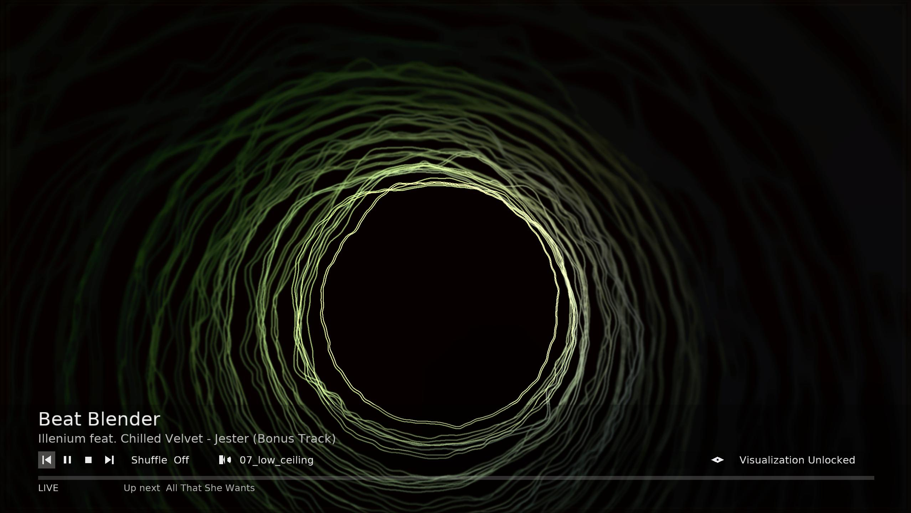
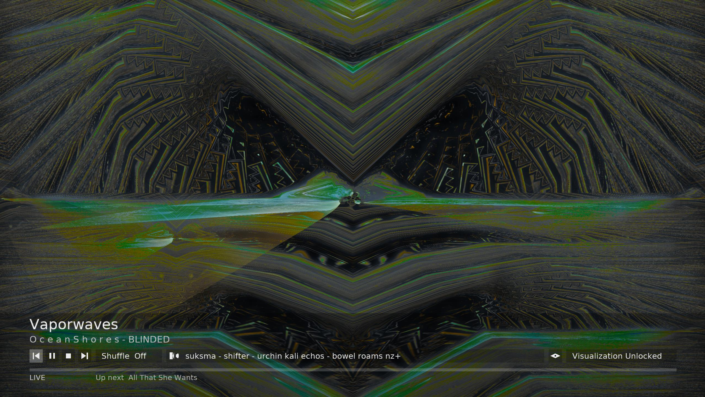

# StOMP

SteamOs Music Player (StOMP) is a CONTROLLER-FIRST music player intended for the living room or the Steam Deck.

Features: 
 - FAST!
 - Milkdrop-style effects thanks to ProjectM
 - A controller-first user interface with keyboard availability if you need it
 - Internet Radio built-in
 - Single executable for easy management
 - No tracking or weird network calls; it never connects to the internet unless you try to play internet radio
 - Written in C
 - Can manage large music libraries of over 10,000 music files without issue
 - Compatibility with MusicControlol Decky plugin; play music while playing games! 
 
## Screenshots





## Install

Download a pre-built binary from the [Releases](Releases/) folder:

- [StOMP 0.1](Releases/StOMP-0.1) (x86_64 Linux)

Mark it executable

Run it to test without installing

Add to Steam in Desktop Mode if you want to have it available in Big Picture


## Build dependencies

The player is an x86_64 Linux binary aimed at **SteamOS / Steam Machine / Big
Picture**. Build on any glibc Linux with:

- GCC (C11/C17) and a C++14 compiler (C++ is only used to compile **libprojectM**)
- CMake ≥ 3.21, Ninja or Make, pkg-config
- SDL2
- FFmpeg 5+ (`libavformat`, `libavcodec`, `libswresample`, `libavutil`)
- FreeType 2
- OpenGL 3.3 core
- SQLite 3 (headers + `libsqlite3.a` are vendored in `third_party/` so the build
  does not need distro `-dev` packages)

libprojectM 4.1.2 is built from a **pruned** `third_party/projectm` tree as a
**shared** library and linked dynamically (LGPL-2.1). Do not static-link it.
Upstream docs, screenshots, tests, and git history are not in this tree.

SteamOS / Arch (workstation or SDK):

```bash
sudo pacman -S --needed base-devel cmake ninja pkgconf sdl2 ffmpeg freetype2 mesa
```

Debian/Ubuntu workstation (to cross-build the same binary):

```bash
sudo apt install build-essential cmake ninja-build pkg-config \
    libsdl2-dev libavformat-dev libavcodec-dev libswresample-dev \
    libavutil-dev libfreetype-dev libgl-dev
```

## CMake

```bash
cd StOMP
cmake -S . -B build -DCMAKE_BUILD_TYPE=Release -G Ninja
cmake --build build
```

`build/stomp` is a **single file** (the packed StOMP executable). libprojectM,
presets, textures, and the HUD font are packed into that ELF (libprojectM stays
a shared library inside the payload, which is what LGPL requires). On first
launch it unpacks into `~/.cache/vibe/r/<id>/` and execs the real player from
there.

```bash
./build/stomp --windowed --music-dir "$HOME/Music"
./build/stomp /path/to/song.flac
```

Copy that one packed file onto a Steam Machine and run it. You can still
inspect the unpacked layout at `build/vibe-core` plus the `.so` files if you
are debugging.

Point the library at folders from **Library → Settings → Music folder**.
That list is saved in `~/.config/vibe/vibe.conf` and used on the next launch.
`--music-dir` still adds a root for the current run. Until you set a folder
in-app, StOMP also looks at `~/Music`, `/run/media/*` (microSD), `/media/*`,
and the bundled `demo/` tone.

Database and session: `~/.local/share/vibe/library.db`.

## Controls

Every gamepad action has a keyboard twin so Steam Input can bind buttons to keys.
The same list is in **Library → Settings → Controls**. The Steam/Guide button is
unbound (Big Picture / on-screen keyboard).

| Function | Gamepad | Keyboard |
|----------|---------|----------|
| Play / confirm | A | Enter, Space |
| Back / hide HUD | B | Esc |
| Add to queue | X | X |
| Search / queue remove | Y | Y |
| Library | Start | Tab |
| Stop | Select | End |
| Queue | R3 | Q |
| Previous / next preset | L1 / R1 | [ / ] |
| Previous / next track | L2 / R2 | P / N |
| Volume | (keyboard) | - / = |
| Move | D-pad or left stick | Arrows |
| Letter jump (albums, artists, folders, …) | D-pad / stick Left Right | Left / Right |
| Seek | Right stick left/right | , / . |
| Page | Right stick up/down | Page Up / Down |
| Search backspace | Y or on-screen Bksp | Backspace |
| Search clear | on-screen Clear | Delete |

Preset lock and track Shuffle sit on the now-playing extras row (Up from the
seek bar, then A). The current visualization name is on the right of that row;
A opens the full preset list. Repeat is a Queue row. Search uses a QWERTY grid
plus Clear/Backspace; Steam’s keyboard also types into the field.

No mouse is required. The SDL Game Controller API is required.

## Formats

FLAC, MP3, Ogg Vorbis, Opus, WAV, AAC/M4A. Output is stereo float 44.1 kHz.
FFmpeg resamples only when needed. The same decoded PCM is written to the
device and fed to ProjectM (target audio-to-visual latency under ~35 ms).
There is no PipeWire/Pulse loopback and no microphone path.

## License

Copyright (C) 2026 JobDestroyer.

StOMP is free software: you can redistribute it and/or modify it under the
terms of the **GNU Lesser General Public License, version 2.1**, the same
license as libprojectM. The full text is in `LICENSE`.

libprojectM is linked **dynamically** as a shared library. Do not static-link it.

Other bundled material keeps its own terms:

- libprojectM 4.1.2 — LGPL-2.1 (`third_party/projectm/LICENSE.txt`)
- SQLite amalgamation — public domain
- DejaVu Sans — DejaVu fonts license (`fonts/README.txt`)
- Droid Sans Fallback — Apache 2.0
- Cream of the Crop presets — see `presets/cream-of-the-crop/LICENSE.md`

SDL2, FFmpeg, FreeType, and OpenGL come from the system and keep their own
licenses. A typical distro FFmpeg is also LGPL; do not enable extra GPL codecs
in a custom FFmpeg build unless you want the whole combination under GPL.
